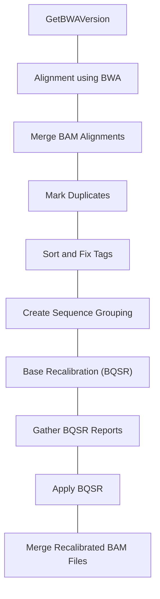
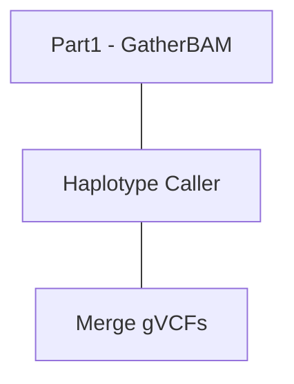
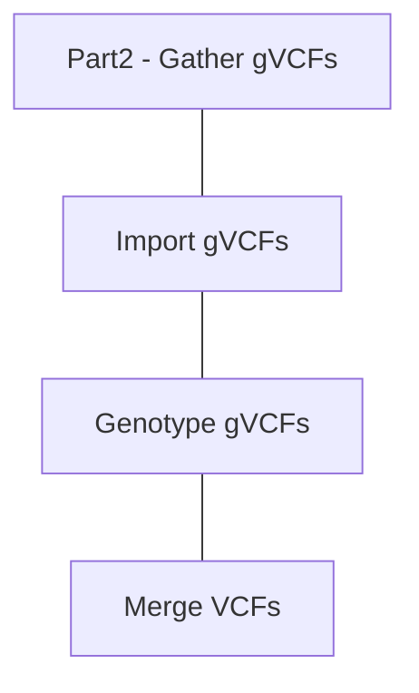

# Introduction to Basic GATK WES Pipeline

Current Release WDL Pipeline at [BroadInstitute WARP](https://broadinstitute.github.io/warp/)


## Part 1: [GATK Data Processing WDL](/share/carvajal-archive/USERS/SHARED/Workflow_Tutorials/GATK_WDL/1_gatk4-data-processing)




### Get BWA Version

### Alignment with BWA

```bash
java -Dsamjdk.compression_level=~{compression_level} 
    -Xms~{command_mem_gb}G 
    -jar picard.jar SamToFastq 
    INPUT=~{input_bam} 
    FASTQ=/dev/stdout INTERLEAVE=true 
    NON_PF=true ~{bwa_path}
```
**Command is Piped `|` to next command**

```bash
bwa mem -K 100000000 -p -v 3 -t 16 -Y $bash_ref_fasta /dev/stdin -
```
**Command is Piped `|` to next command**

```bash
samtools view -1 - > ~{output_bam_basename}.bam
```

### Merge BAM Alignments
```bash
    gatk --java-options "-Dsamjdk.compression_level=~{compression_level} -Xms~{command_mem_gb}G" \
      MergeBamAlignment \
      --VALIDATION_STRINGENCY SILENT \
      --EXPECTED_ORIENTATIONS FR \
      --ATTRIBUTES_TO_RETAIN X0 \
      --ALIGNED_BAM ~{aligned_bam} \
      --UNMAPPED_BAM ~{unmapped_bam} \
      --OUTPUT ~{output_bam_basename}.bam \
      --REFERENCE_SEQUENCE ~{ref_fasta} \
      --PAIRED_RUN true \
      --SORT_ORDER "unsorted" \
      --IS_BISULFITE_SEQUENCE false \
      --ALIGNED_READS_ONLY false \
      --CLIP_ADAPTERS false \
      --MAX_RECORDS_IN_RAM 2000000 \
      --ADD_MATE_CIGAR true \
      --MAX_INSERTIONS_OR_DELETIONS -1 \
      --PRIMARY_ALIGNMENT_STRATEGY MostDistant \
      --PROGRAM_RECORD_ID "bwamem" \
      --PROGRAM_GROUP_VERSION "~{bwa_version}" \
      --PROGRAM_GROUP_COMMAND_LINE "~{bwa_commandline}" \
      --PROGRAM_GROUP_NAME "bwamem" \
      --UNMAPPED_READ_STRATEGY COPY_TO_TAG \
      --ALIGNER_PROPER_PAIR_FLAGS true \
      --UNMAP_CONTAMINANT_READS true
```

### Mark Duplicates

```bash
gatk --java-options "-Dsamjdk.compression_level=~{compression_level} 
     -Xms~{command_mem_gb}G" 
      MarkDuplicates 
      --INPUT ~{sep=' --INPUT ' input_bams} 
      --OUTPUT ~{output_bam_basename}.bam 
      --METRICS_FILE ~{metrics_filename} 
      --VALIDATION_STRINGENCY SILENT 
      --OPTICAL_DUPLICATE_PIXEL_DISTANCE 2500 
      --ASSUME_SORT_ORDER "queryname" 
      --CREATE_MD5_FILE true
```

### Sort and Fix Tags

```bash
gatk --java-options "-Dsamjdk.compression_level=~{compression_level} 
    -Xms~{command_mem_gb_sort}G" \
    SortSam \
    --INPUT ~{input_bam} \
    --OUTPUT /dev/stdout \
    --SORT_ORDER "coordinate" \
    --CREATE_INDEX false \
    --CREATE_MD5_FILE false
```
**Command is Piped `|` to next command**

```bash
gatk --java-options "-Dsamjdk.compression_level=~{compression_level} 
    -Xms~   {command_mem_gb_fix}G" \
    SetNmMdAndUqTags \
    --INPUT /dev/stdin \
    --OUTPUT ~{output_bam_basename}.bam \
    --CREATE_INDEX true \
    --CREATE_MD5_FILE true \
    --REFERENCE_SEQUENCE ~{ref_fasta}
```

### Create Sequence Groupings

```python
 python <<CODE
    with open("~{ref_dict}", "r") as ref_dict_file:
        sequence_tuple_list = []
        longest_sequence = 0
        for line in ref_dict_file:
            if line.startswith("@SQ"):
                line_split = line.split("\t")
                # (Sequence_Name, Sequence_Length)
                sequence_tuple_list.append((line_split[1].split("SN:")[1], int(line_split[2].split("LN:")[1])))
        longest_sequence = sorted(sequence_tuple_list, key=lambda x: x[1], reverse=True)[0][1]
    # We are adding this to the intervals because hg38 has contigs named with embedded colons (:) and a bug in 
    # some versions of GATK strips off the last element after a colon, so we add this as a sacrificial element.
    hg38_protection_tag = ":1+"
    # initialize the tsv string with the first sequence
    tsv_string = sequence_tuple_list[0][0] + hg38_protection_tag
    temp_size = sequence_tuple_list[0][1]
    for sequence_tuple in sequence_tuple_list[1:]:
        if temp_size + sequence_tuple[1] <= longest_sequence:
            temp_size += sequence_tuple[1]
            tsv_string += "\t" + sequence_tuple[0] + hg38_protection_tag
        else:
            tsv_string += "\n" + sequence_tuple[0] + hg38_protection_tag
            temp_size = sequence_tuple[1]
    # add the unmapped sequences as a separate line to ensure that they are recalibrated as well
    with open("sequence_grouping.txt","w") as tsv_file:
      tsv_file.write(tsv_string)
      tsv_file.close()

    tsv_string += '\n' + "unmapped"

    with open("sequence_grouping_with_unmapped.txt","w") as tsv_file_with_unmapped:
      tsv_file_with_unmapped.write(tsv_string)
      tsv_file_with_unmapped.close()
    CODE
```

### Base Recalibration

```bash
gatk --java-options "-Xms~{command_mem_gb}G" \
    BaseRecalibrator \
    -R ~{ref_fasta} \
    -I ~{input_bam} \
    --use-original-qualities \
    -O ~{recalibration_report_filename} \
    --known-sites ~{dbSNP_vcf} \
    --known-sites ~{sep=" --known-sites " known_indels_sites_VCFs} \
    -L ~{sep=" -L " sequence_group_interval}
```


#### Gather BQSR Reports

```bash
gatk --java-options "-Xms~{command_mem_gb}G" \
    GatherBQSRReports \
    -I ~{sep=' -I ' input_bqsr_reports} \
    -O ~{output_report_filename}
```

#### Apply BQSR

```bash
gatk --java-options "-Xms~{command_mem_gb}G" \
    ApplyBQSR \
    -R ~{ref_fasta} \
    -I ~{input_bam} \
    -O ~{output_bam_basename}.bam \
    -L ~{sep=" -L " sequence_group_interval} \
    -bqsr ~{recalibration_report} \
    --static-quantized-quals 10 --static-quantized-quals 20 --static-quantized-quals 30 \
    --add-output-sam-program-record \
    --create-output-bam-md5 \
    --use-original-qualities
```

### Merge Recalibration BAM Files

```bash
gatk --java-options "-Dsamjdk.compression_level=~{compression_level}
    -Xms~{command_mem_gb}G" \
    GatherBamFiles \
    --INPUT ~{sep=' --INPUT ' input_bams} \
    --OUTPUT ~{output_bam_basename}.bam \
    --CREATE_INDEX true \
    --CREATE_MD5_FILE true
```


## Part 2: GATK Germline SNP-Indel Calling

### Haplotype Caller

```bash
gatk --java-options "-Xmx~{command_mem_gb}G ~{java_opt}" \
    HaplotypeCaller \
    -R ~{ref_fasta} \
    -I ~{input_bam} \
    -L ~{interval_list} \
    -O ~{output_filename} \
    -contamination ~{default="0" contamination} \
    -G StandardAnnotation -G StandardHCAnnotation ~{true="-G AS_StandardAnnotation" false="" make_gvcf} \
    -GQB 10 -GQB 20 -GQB 30 -GQB 40 -GQB 50 -GQB 60 -GQB 70 -GQB 80 -GQB 90 \
    ~{true="-ERC GVCF" false="" make_gvcf} \
    ~{if defined(gcs_project_for_requester_pays) then "--gcs-project-for-requester-pays ~{gcs_project_for_requester_pays}" else ""} \
    ~{bamout_arg}
```
### Gather gVCFs

```bash
 ~{gatk_path} --java-options "-Xmx~{command_mem_gb}G"  \
      MergeVcfs \
      --INPUT ~{sep=' --INPUT ' input_vcfs} \
      --OUTPUT ~{output_filename}
```

## Part 3:  Joint Genotyping




### Import gVCFs

```bash
~{gatk_path} --java-options "-Xmx~{command_mem_gb}G ~{java_opt}" \
      IndexFeatureFile \
      -I ~{new_name} \
      -O ~{index_name}
```

```bash
gatk --java-options "-Xmx~{command_mem_gb}G ~{java_opt}" \
      GenomicsDBImport \
      -V ~{sep=' -V ' input_gvcfs} \
      -L ~{interval} \
      --genomicsdb-workspace-path ~{workspace_dir_name} \
      --batch-size 50 \
      --reader-threads 5 \
      --merge-input-intervals \
      --consolidate
```

### Genotype gVCFs

```bash
gatk --java-options "-Xmx~{command_mem_gb}G ~{java_opt}" \
      GenotypeGVCFs \
      -R ~{ref_fasta} \
      -V gendb://$WORKSPACE \
      -L ~{interval} \
      -O ~{output_vcf_filename} \
      -G StandardAnnotation -G AS_StandardAnnotation \
      --allow-old-rms-mapping-quality-annotation-data \
      --merge-input-intervals
```

### Merge VCFs

```bash
gatk --java-options "-Xmx~{command_mem_gb}G ~{java_opt}" \
      MergeVcfs \
      -I ~{sep=' -I' input_vcfs} \
      -O ~{merged_vcf_filename}
```

## Next Steps:

1. Variant Recalibration using [VariantRecalibrator and ApplyVQSR](https://gatk.broadinstitute.org/hc/en-us/articles/360035531612-Variant-Quality-Score-Recalibration-VQSR-)
2. Variant Annotation using [Annovar ](https://annovar.openbioinformatics.org/en/latest/user-guide/download/)
3. Variant visual validation using GenomeBrowse and IGV
