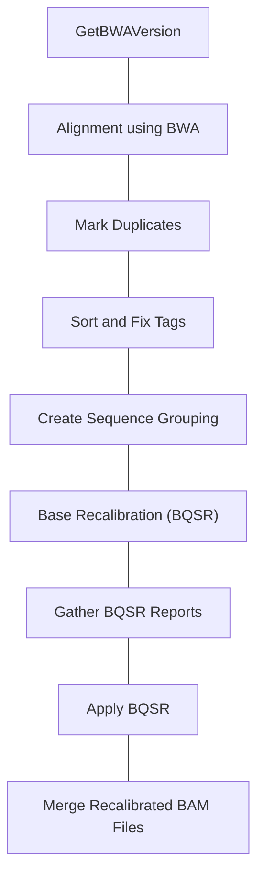
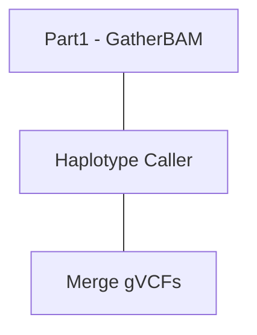
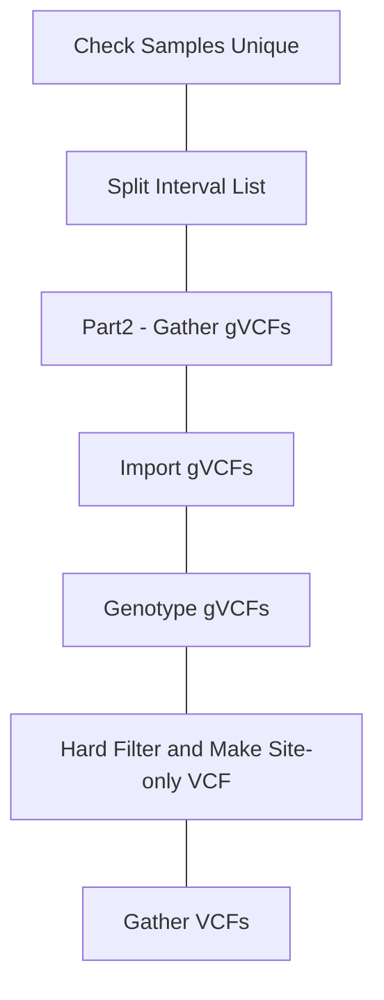
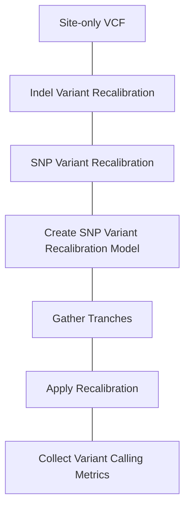

# Introduction to Basic GATK WES Pipeline

Please note that the parameters and commands listed below were take from an older version of the GATK germline workflows. 

It is teaching purposes only and you should refer to the [WARP pipelines](https://github.com/broadinstitute/warp) for upto date commands and parameters. The WARP WDL are a bit more complex, where as the complete older pipeline could be found in a single WDL,  the newer WARP WDL combines many different WDL files, so it can be a bit more challenging to follow the code.  In later sections, I'll go through how WARP is organized.

Current Release WDL Pipeline at [BroadInstitute WARP](https://broadinstitute.github.io/warp/)


## Pipeline Preparation
You'll notice that the first step in GATK takes a raw Unmapped Reads unmapped BAM file or Fastq file

To prepare a unmapped BAM file, you need to use `FastqToSam` utility.

```bash
java -jar picard.jar FastqToSam \
    F1={R1} \ # Read 1 Fastq
    F2={R2} \ # Read 2 Fastq
    O={Unaligned BAM Filename} \ #Output BAM Filename
    SM={RG_SM} \ #Read Group Sample
    RG={RG_ID} \ #Read Group ID
    CO={RG_CO} \ #Read Group Comment
    DS={RG_DS} \ #Read Group Description
    LB={RG_LB} \ #Read Group Library
    PL={RG_PL} \ #Read Group Platform (ILLUMINA)
    PU={RG_PU} \ #Read Group Platuform Unit Barcode.Lane
    DT={RG_DT} \ #Read Group Date
    CN={RG_CN}   #Read Group Sequencing Center
```

---

## Part 1: [GATK Data Processing WDL](/share/carvajal-archive/USERS/SHARED/Workflow_Tutorials/GATK_WDL/1_gatk4-data-processing)


---

### Get BWA Version

Check the version of BWA to ensure that it's the latest release, which suspports some

---
### Alignment with BWA

This contains multiple commands that are piped together.  This reduces the amount of Disk I/O allowing one command to stream it's output to the next one's input - until being output to a BAM file.


```bash
#Stream Fastq records from unmapped-BAM to BWA MEM
java -Dsamjdk.compression_level=~{compression_level} 
    -Xms7G 
    -jar picard.jar SamToFastq 
    INPUT=~{input_bam} 
    FASTQ=/dev/stdout INTERLEAVE=true 
    NON_PF=true # Include non-pass filter reads.
```
**Command is Piped `|` to next command**

```bash
#BWA Mem 
#See BWA-kit for more on ALT Aware mapping https://github.com/lh3/bwa/blob/master/README-alt.md
bwa mem -K 100000000 -p -v 3 -t 16 -Y $bash_ref_fasta
```

**Command is Piped `|` to next command**

```bash
java -Dsamjdk.compression_level=~{compression_level} -Xms1000m -Xmx1000m -jar picard.jar \
    MergeBamAlignment \
    VALIDATION_STRINGENCY=SILENT \
    EXPECTED_ORIENTATIONS=FR \
    ATTRIBUTES_TO_RETAIN=X0 \
    ATTRIBUTES_TO_REMOVE=NM \
    ATTRIBUTES_TO_REMOVE=MD \
    ALIGNED_BAM=/dev/stdin \
    UNMAPPED_BAM=~{input_bam} \
    OUTPUT=~{output_bam_basename}.bam \
    REFERENCE_SEQUENCE=~{reference_fasta.ref_fasta} \
    SORT_ORDER="unsorted" \
    IS_BISULFITE_SEQUENCE=false \
    ALIGNED_READS_ONLY=false \
    CLIP_ADAPTERS=false \
    ~{true='CLIP_OVERLAPPING_READS=true' false="" hard_clip_reads} \
    ~{true='CLIP_OVERLAPPING_READS_OPERATOR=H' false="" hard_clip_reads} \
    MAX_RECORDS_IN_RAM=2000000 \
    ADD_MATE_CIGAR=true \
    MAX_INSERTIONS_OR_DELETIONS=-1 \
    PRIMARY_ALIGNMENT_STRATEGY=MostDistant \
    PROGRAM_RECORD_ID="bwamem" \
    PROGRAM_GROUP_VERSION="${BWA_VERSION}" \
    PROGRAM_GROUP_COMMAND_LINE="~{bwa_commandline}" \
    PROGRAM_GROUP_NAME="bwamem" \
    UNMAPPED_READ_STRATEGY=COPY_TO_TAG \
    ALIGNER_PROPER_PAIR_FLAGS=true \
    UNMAP_CONTAMINANT_READS=~{unmap_contaminant_reads} \
    ADD_PG_TAG_TO_READS=false
```
---

### Mark Duplicates

```bash
gatk --java-options "-Dsamjdk.compression_level=~{compression_level} 
    -Xms4G" 
    MarkDuplicates 
    --INPUT ~{sep=' --INPUT ' input_bams} 
    --OUTPUT ~{output_bam_basename}.bam 
    --METRICS_FILE ~{metrics_filename} 
    --VALIDATION_STRINGENCY SILENT 
    --OPTICAL_DUPLICATE_PIXEL_DISTANCE 2500 
    --ASSUME_SORT_ORDER "queryname" 
    --CREATE_MD5_FILE true
```
---

### Sort and Fix Tags

```bash
gatk --java-options "-Dsamjdk.compression_level=~{compression_level} 
    -Xms 16G" \
    SortSam \
    --INPUT ~{input_bam} \
    --OUTPUT /dev/stdout \
    --SORT_ORDER "coordinate" \
    --CREATE_INDEX false \
    --CREATE_MD5_FILE false
```
**Command is Piped `|` to next command**

```bash
gatk --java-options "-Dsamjdk.compression_level=~{compression_level} 
    -Xms 16G" \
    SetNmMdAndUqTags \
    --INPUT /dev/stdin \
    --OUTPUT ~{output_bam_basename}.bam \
    --CREATE_INDEX true \
    --CREATE_MD5_FILE true \
    --REFERENCE_SEQUENCE ~{ref_fasta}
```
---

### Create Sequence Groupings

```python
 python <<CODE
    with open("~{ref_dict}", "r") as ref_dict_file:
        sequence_tuple_list = []
        longest_sequence = 0
        for line in ref_dict_file:
            if line.startswith("@SQ"):
                line_split = line.split("\t")
                # (Sequence_Name, Sequence_Length)
                sequence_tuple_list.append((line_split[1].split("SN:")[1], int(line_split[2].split("LN:")[1])))
        longest_sequence = sorted(sequence_tuple_list, key=lambda x: x[1], reverse=True)[0][1]
    # We are adding this to the intervals because hg38 has contigs named with embedded colons (:) and a bug in 
    # some versions of GATK strips off the last element after a colon, so we add this as a sacrificial element.
    hg38_protection_tag = ":1+"
    # initialize the tsv string with the first sequence
    tsv_string = sequence_tuple_list[0][0] + hg38_protection_tag
    temp_size = sequence_tuple_list[0][1]
    for sequence_tuple in sequence_tuple_list[1:]:
        if temp_size + sequence_tuple[1] <= longest_sequence:
            temp_size += sequence_tuple[1]
            tsv_string += "\t" + sequence_tuple[0] + hg38_protection_tag
        else:
            tsv_string += "\n" + sequence_tuple[0] + hg38_protection_tag
            temp_size = sequence_tuple[1]
    # add the unmapped sequences as a separate line to ensure that they are recalibrated as well
    with open("sequence_grouping.txt","w") as tsv_file:
      tsv_file.write(tsv_string)
      tsv_file.close()

    tsv_string += '\n' + "unmapped"

    with open("sequence_grouping_with_unmapped.txt","w") as tsv_file_with_unmapped:
      tsv_file_with_unmapped.write(tsv_string)
      tsv_file_with_unmapped.close()
    CODE
```
---

### Base Recalibration

```bash
gatk --java-options "-Xms5G" \
    BaseRecalibrator \
    -R ~{ref_fasta} \
    -I ~{input_bam} \
    --use-original-qualities \
    -O ~{recalibration_report_filename} \
    --known-sites ~{dbSNP_vcf} \
    --known-sites ~{sep=" --known-sites " known_indels_sites_VCFs} \
    -L ~{sep=" -L " sequence_group_interval}
```


#### Gather BQSR Reports

```bash
gatk --java-options "-Xms3G" \
    GatherBQSRReports \
    -I ~{sep=' -I ' input_bqsr_reports} \
    -O ~{output_report_filename}
```

#### Apply BQSR

```bash
gatk --java-options "-Xms3G" \
    ApplyBQSR \
    -R ~{ref_fasta} \
    -I ~{input_bam} \
    -O ~{output_bam_basename}.bam \
    -L ~{sep=" -L " sequence_group_interval} \
    -bqsr ~{recalibration_report} \
    --static-quantized-quals 10 --static-quantized-quals 20 --static-quantized-quals 30 \
    --add-output-sam-program-record \
    --create-output-bam-md5 \
    --use-original-qualities
```

### Merge Recalibration BAM Files

```bash
gatk --java-options "-Dsamjdk.compression_level=~{compression_level}
    -Xms3G" \
    GatherBamFiles \
    --INPUT ~{sep=' --INPUT ' input_bams} \
    --OUTPUT ~{output_bam_basename}.bam \
    --CREATE_INDEX true \
    --CREATE_MD5_FILE true
```

---

## Part 2: GATK Germline SNP-Indel Calling



### Haplotype Caller

```bash
gatk --java-options "-Xmx9G ~{java_opt}" \
    HaplotypeCaller \
    -R ~{ref_fasta} \
    -I ~{input_bam} \
    -L ~{interval_list} \
    -O ~{output_filename} \
    -contamination ~{default="0" contamination} \
    -G StandardAnnotation -G StandardHCAnnotation ~{true="-G AS_StandardAnnotation" false="" make_gvcf} \
    -GQB 10 -GQB 20 -GQB 30 -GQB 40 -GQB 50 -GQB 60 -GQB 70 -GQB 80 -GQB 90 \
    ~{true="-ERC GVCF" false="" make_gvcf} \
    ~{if defined(gcs_project_for_requester_pays) then "--gcs-project-for-requester-pays ~{gcs_project_for_requester_pays}" else ""} \
    ~{bamout_arg}
```

### Gather gVCFs

```bash
 ~{gatk_path} --java-options "-Xmx2500m -xms2000m "  \
      MergeVcfs \
      --INPUT ~{sep=' --INPUT ' input_vcfs} \
      --OUTPUT ~{output_filename}
```
---

## Part 3:  Joint Genotyping




### Import gVCFs

```bash
gatk --java-options "-Xmx15500m -Xms15000m" \
    IndexFeatureFile \
    -I ~{new_name} \
    -O ~{index_name}
```

```bash
gatk --java-options "-Xms8000m -Xmx25000m" \
    GenomicsDBImport \
    -V ~{sep=' -V ' input_gvcfs} \
    -L ~{interval} \
    --genomicsdb-workspace-path ~{workspace_dir_name} \
    --batch-size 50 \
    --reader-threads 5 \
    --merge-input-intervals \
    --consolidate
```

### Genotype gVCFs

```bash
gatk --java-options "-Xms8000m -Xmx25000m" \
    GenotypeGVCFs \
    -R ~{ref_fasta} \
    -V gendb://$WORKSPACE \
    -L ~{interval} \
    -O ~{output_vcf_filename} \
    -G StandardAnnotation -G AS_StandardAnnotation \
    --allow-old-rms-mapping-quality-annotation-data \
    --merge-input-intervals
```

### Merge VCFs

```bash
gatk --java-options "-Xms2000m -Xmx2500m" \
      MergeVcfs \
      -I ~{sep=' -I' input_vcfs} \
      -O ~{merged_vcf_filename}
```

### Hard Filter and Site-only VCF

```bash
    gatk --java-options "-Xms3000m -Xmx3250m" \
      VariantFiltration \
      --filter-expression "ExcessHet > ~{excess_het_threshold}" \
      --filter-name ExcessHet \
      -O ~{variant_filtered_vcf_filename} \
      -V ~{vcf}

    gatk --java-options "-Xms3000m -Xmx3250m" \
      MakeSitesOnlyVcf \
      -I ~{variant_filtered_vcf_filename} \
      -O ~{sites_only_vcf_filename}
```

---

## Variant Filtering and Recalibration
 -  Variant Recalibration using [VariantRecalibrator and ApplyVQSR](https://gatk.broadinstitute.org/hc/en-us/articles/360035531612-Variant-Quality-Score-Recalibration-VQSR-)
 - https://gatk.broadinstitute.org/hc/en-us/articles/4402736812443-Which-training-sets-arguments-should-I-use-for-running-VQSR-
 - https://gatk.broadinstitute.org/hc/en-us/articles/360035531572-Evaluating-the-quality-of-a-germline-short-variant-callset



```bash
gatk --java-options "-Xms24000m -Xmx25000m" \
      VariantRecalibrator \
      -V ~{sites_only_variant_filtered_vcf} \
      -O ~{recalibration_filename} \
      --tranches-file ~{tranches_filename} \
      --trust-all-polymorphic \
      -tranche ~{sep=' -tranche ' recalibration_tranche_values} \
      -an ~{sep=' -an ' recalibration_annotation_values} \
      ~{true='--use-allele-specific-annotations' false='' use_allele_specific_annotations} \
      -mode INDEL \
      --max-gaussians ~{max_gaussians} \
      -resource:mills,known=false,training=true,truth=true,prior=12 ~{mills_resource_vcf} \
      -resource:axiomPoly,known=false,training=true,truth=false,prior=10 ~{axiomPoly_resource_vcf} \
      -resource:dbsnp,known=true,training=false,truth=false,prior=2 ~{dbsnp_resource_vcf}
```


1. [Genotype Refinement](https://gatk.broadinstitute.org/hc/en-us/articles/360035531432-Genotype-Refinement-workflow-for-germline-short-variants)

---

## Variant Annotations

We've used [Annovar](https://annovar.openbioinformatics.org/en/latest/) 

 1. Select AnnotationDatasets to use for Annotation
 2. Run Annovar on VCF

### 1. Selecting Datasets to use for Annotation
Annovar splits annotations into 3 different types:  **Gene**, **Region**, **Filter**

**Gene**
Gene annotations are based upon transcription and list the effect of the mutation
 - [Available Annovar Annotation Datasets](https://annovar.openbioinformatics.org/en/latest/user-guide/download/)

1. Variant Function
2. Exonic Variant Function

**1. Variant Function**
Provides a couple columns detailing the **Function** and **Gene**/**Nearest Gene**

| Variant Function | Precedence  | Description | Sequence Ontology |
| ---------------- | ----------- | ----------- | ----------------- |
| exonic           | 1           | variant overlaps a coding region | exon_variant (SO:0001791) |
| splicing         | 2           | variant is within 2-bp of a splicing junction| splicing_variant (SO:0001568) |
| ncRNA            | 2           |variant overlaps a transcript without coding annotation in the gene definition | non_coding_transcript_variant (SO:0001619) |
| UTR5 | 3 | variant overlaps a 5' untranslated region | 5_prime_UTR_variant (SO:0001623) |
| UTR3 | 3 | variant overlaps a 3' untranslated region | 3_prime_UTR_variant (SO:0001624) |
| intronic | 4 | variant overlaps an intron | intron_variant (SO:0001627) |
| upstream | 5 | variant overlaps 1-kb region upstream of transcription start site | upstream_gene_variant (SO:0001631)
| downstream |5 | variant overlaps 1-kb region downtream of transcription end site | downstream_gene_variant(SO:0001632) |
| intergenic | 6 | variant is in intergenic region | intergenic_variant (SO:0001628) |


**2. Exonic Variant Function**
Exonic Variant Functions provides multiple columns detailing the exonic functional effect of the variant and the HGVSc, HGVSp annotations.  Please note that the HGVS annotations generated by Annovar are not always correct and should be verified before publication.

| Annotation | Precedence | Explanation | Sequence Ontology |
| ---------- | ---------- | ----------- | ----------------- |
| frameshift insertion | 1 | an insertion of one or more nucleotides that cause frameshift changes in protein coding sequence | frameshift_elongation (SO:0001909) |
| frameshift deletion | 2 | a deletion of one or more nucleotides that cause frameshift changes in protein coding sequence | frameshift_truncation (SO:0001910) |
| frameshift block substitution | 3 | a block substitution of one or more nucleotides that cause frameshift changes in protein coding sequence | frameshift_variant (SO:0001589) |
| stopgain | 4 | a nonsynonymous SNV, frameshift insertion/deletion, nonframeshift insertion/deletion or block substitution that lead to the immediate creation of stop codon at the variant site. For frameshift mutations, the creation of stop codon downstream of the variant will not be counted as "stopgain"! | stop_gained (SO:0001587) |
| stoploss | 5 | a nonsynonymous SNV, frameshift insertion/deletion, nonframeshift insertion/deletion or block substitution that lead to the immediate elimination of stop codon at the variant site | stop_lost (SO:0001578) |
| nonframeshift insertion | 6 | an insertion of 3 or multiples of 3 nucleotides that do not cause frameshift changes in protein coding sequence | inframe_insertion (SO:0001821) |
| nonframeshift deletion | 7 | a deletion of 3 or mutliples of 3 nucleotides that do not cause frameshift changes in protein coding sequence | inframe_deletion (SO:0001822) |
| nonframeshift block substitution | 8 | a block substitution of one or more nucleotides that do not cause frameshift changes in protein coding sequence | inframe_variant (SO:0001650) |
| nonsynonymous SNV | 9 | a single nucleotide change that cause an amino acid change | missense_variant (SO:0001583) |
| synonymous SNV | 10 | a single nucleotide change that does not cause an amino acid change | synonymous_variant (SO:0001819) |
| unknown | 11 | unknown function (due to various errors in the gene structure definition in the database file) | sequence_variant (SO:0001060) |


**Additional Annotations Programs**
 1. [SnpEff](https://pcingola.github.io/SnpEff/)
 2. [Ensembl VEP](https://useast.ensembl.org/info/docs/tools/vep/index.html)
 3. [Illumina Nirvana](https://illumina.github.io/NirvanaDocumentation/)
 4. [CADD 1.6 Offline](https://cadd.gs.washington.edu/download)
 5. [SNPnexus](https://www.snp-nexus.org/v4/)


## Visual Inspection and Validation
 - Variant visual validation using GenomeBrowse and IGV
